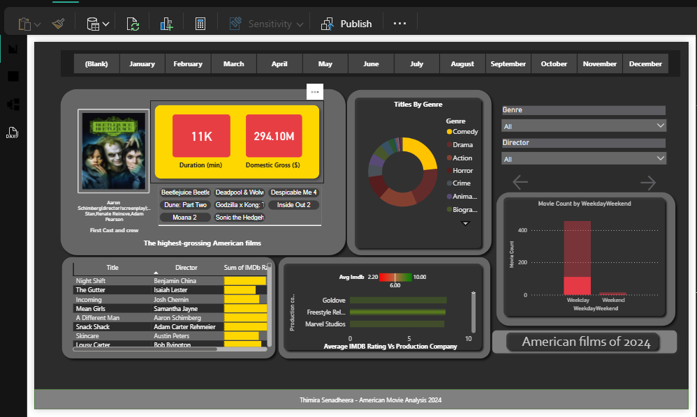

# 🎬 2024 Movie Analysis Dashboard  


---

## 📊 Project Overview  

> Transforming raw movie data into an interactive Power BI dashboard to uncover insights from 2024 American movies.

---

## 🚀 Workflow  
<p align="center">  </p>


### 📥 Data Collection  


```python
# Tools Used
- BeautifulSoup (Web Scraping)
- OMDb API (Data Enrichment)

# Data Collected
- Movie Titles
- IMDb Ratings
- Genres
- Release Dates


🛠️ Data Preparation
-- Performed in Power Query
- Cleaned missing/null values
- Converted runtime → minutes
- Created categories (Weekday vs Weekend)
- Built calculated columns for analysis


Visualization & Dashboard

Dashboard Features:
  - Popular Genres & Production Companies
  - IMDb Ratings by Production Company
  - Monthly Release Trends
  - Interactive Filters (Genre, Weekday/Weekend) 


Design System
Theme: #2C2C2C (Dark Cinematic)
KPI Colors: Gold & Red
Visuals:
  - Dynamic Movie Posters (URL-based)
  - Interactive Slicers 

